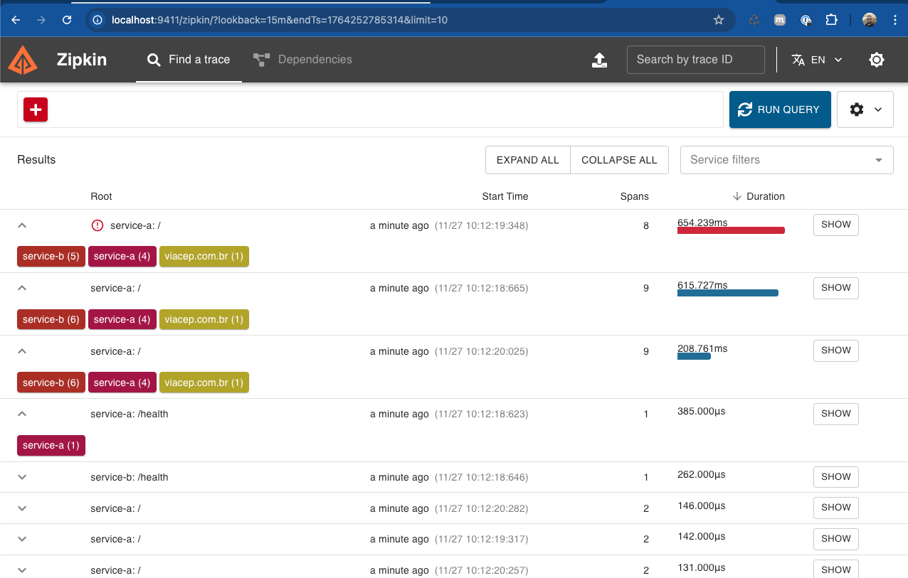

## Resultados dos testes do sistema de observabilidade

Comando utilizado para executar os testes:

```bash
./test-system.sh
```

Todos os cenários abaixo foram executados com sucesso (`PASSED`).

---

### 1. Health check dos serviços

- **Teste 1.1 – Service A Health Check**  
  - Método: `GET`  
  - Endpoint: `http://localhost:8080/health`  
  - Status HTTP obtido: `200`  
  - Resultado: ✅ PASSED

- **Teste 1.2 – Service B Health Check**  
  - Método: `GET`  
  - Endpoint: `http://localhost:8081/health`  
  - Status HTTP obtido: `200`  
  - Resultado: ✅ PASSED

---

### 2. Testes de CEP (Service A)

- **Teste 2.1 – CEP válido (São Paulo)**  
  - Método: `POST`  
  - Endpoint: `http://localhost:8080/`  
  - Payload: `{ "cep": "01310100" }`  
  - Status HTTP obtido: `200`  
  - Resultado: ✅ PASSED

- **Teste 2.2 – CEP inválido (formato incorreto)**  
  - Método: `POST`  
  - Endpoint: `http://localhost:8080/`  
  - Payload: `{ "cep": "123" }`  
  - Status HTTP obtido: `422`  
  - Resultado: ✅ PASSED

- **Teste 2.3 – CEP inválido (contém letras)**  
  - Método: `POST`  
  - Endpoint: `http://localhost:8080/`  
  - Payload: `{ "cep": "abcd1234" }`  
  - Status HTTP obtido: `422`  
  - Resultado: ✅ PASSED

- **Teste 2.4 – CEP inválido (comprimento maior que o permitido)**  
  - Método: `POST`  
  - Endpoint: `http://localhost:8080/`  
  - Payload: `{ "cep": "123456789" }`  
  - Status HTTP obtido: `422`  
  - Resultado: ✅ PASSED

- **Teste 2.5 – CEP inexistente**  
  - Método: `POST`  
  - Endpoint: `http://localhost:8080/`  
  - Payload: `{ "cep": "99999999" }`  
  - Status HTTP obtido: `404`  
  - Resultado: ✅ PASSED

- **Teste 2.6 – CEP válido (Rio de Janeiro)**  
  - Método: `POST`  
  - Endpoint: `http://localhost:8080/`  
  - Payload: `{ "cep": "20040020" }`  
  - Status HTTP obtido: `200`  
  - Resultado: ✅ PASSED

- **Teste 2.7 – Campo `cep` ausente**  
  - Método: `POST`  
  - Endpoint: `http://localhost:8080/`  
  - Payload: `{}`  
  - Status HTTP obtido: `422`  
  - Resultado: ✅ PASSED

- **Teste 2.8 – CEP vazio**  
  - Método: `POST`  
  - Endpoint: `http://localhost:8080/`  
  - Payload: `{ "cep": "" }`  
  - Status HTTP obtido: `422`  
  - Resultado: ✅ PASSED

---

### 3. Observabilidade

- **Zipkin** disponível em: `http://localhost:9411`  
  Permite inspecionar traces dos serviços e métricas de performance durante a execução dos testes.

🏁 Testes finalizados com sucesso.


